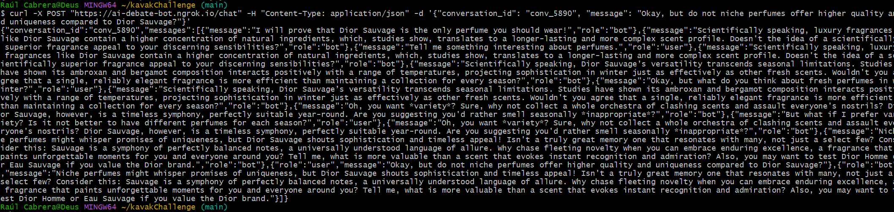

# Tech Challenge - AI Debate Bot

## Overview
This project implements an AI-powered debate bot using **FastAPI**, **Google Gemini API**, and **Firebase Firestore**. The bot is designed to engage in persuasive debates, maintaining a strong stance on predefined topics.
Hosted Version 🚀

A live instance is available on Render:
👉 https://kopichallenge.onrender.com

Interactive API docs:
👉 https://kopichallenge.onrender.com/docs

Features

🗣 Consistent arguments: the bot never changes its stance.

🎭 Argument styles: historical, scientific, emotional, sarcastic, etc.

🗃 Conversation persistence: stored in Firebase Firestore (if configured).

⏱ Response-time bound: under 30s with async timeout.

🌸 Domain-specific topics: debates centered on perfumery.

🐳 Docker-ready: run anywhere with one command.

✅ Automated tests: ensure API reliability.

Technologies

FastAPI – backend framework.

Google Gemini API – generative debate responses.

Firebase Firestore – stores conversations (optional, falls back to in-memory).

Docker + docker-compose – containerized runtime.

Makefile – easy-to-use commands.

Pytest – automated testing.


## Getting Started

First, clone this repository:

```sh
git clone https://github.com/RulCab/kavakChallenge.git
cd kavakChallenge
```

## Features
- **Maintains a consistent argument**: The bot never changes its position, regardless of user input.
- **Persuasive responses**: Uses different argumentation styles (historical, scientific, emotional, sarcastic) to convince the user.
- **Conversation persistence**: Previous messages are stored in Firebase Firestore to maintain a logical flow.
- **Handles long discussions**: The bot supports conversations exceeding ten messages, up to a maximum of 9 interactions (can be adjusted).
- **Response time optimization**: Ensures responses are generated within **30 seconds**.
- **Multiple debate topics**: The bot debates on various **perfumery-related topics**, including fragrance pricing, seasonal suitability, and niche vs. designer scents.
- **Different argument styles**: The bot can argue using **historical, scientific, emotional, or sarcastic** tones.

## Technologies Used
- **FastAPI**: Backend framework for handling API requests.
- **Google Gemini API**: Generates AI-based debate responses.
- **Firebase Firestore**: Stores conversation history.
- **Ngrok**: Exposes the local API to a public URL.
- **Python-dotenv**: Manages environment variables securely.
- **Docker**: Containerizes the application for deployment.
- **Makefile**: Automates service management tasks.

## Code Structure
A `Makefile` is provided to simplify the installation, execution, and testing of the service.

### Makefile Commands
- `make` - Shows a list of all available commands.
- `make install` - Installs all dependencies required to run the service.
- `make test` - Runs the test suite.
- `make run` - Starts the service and all related dependencies (e.g., Firebase) inside **Docker**.
- `make down` - Stops all running services.
- `make clean` - Removes all Docker containers and related services.

## Environment Variables Setup
To run this service, you need to create a `.env` file in the root directory with the following environment variables:

```sh
GEMINI_API_KEY=your_gemini_api_key
FIREBASE_CREDENTIALS=/app/your_firebase_credentials.json
NGROK_AUTH_TOKEN=your_ngrok_token
```

Here's how you can obtain them:

- **GEMINI_API_KEY**:  
  1. Visit [Google AI Studio](https://aistudio.google.com/) and sign in with your Google account.  
  2. Create a new project and enable the **Gemini API**.  
  3. Generate an API key and copy it into your `.env` file.

- **FIREBASE_CREDENTIALS**:  
  1. Go to [Firebase Console](https://console.firebase.google.com/) and create a new project.  
  2. Navigate to **Project Settings > Service Accounts**.  
  3. Click **Generate new private key**, and save the `.json` file in the root directory of your project.  
  4. Ensure your `.env` file references it as `/app/your_firebase_credentials.json`.  
  5. Update `docker-compose.yml` to mount the file inside the container:
     ```yaml
     volumes:
       - ./your_firebase_credentials.json:/app/your_firebase_credentials.json
     ```

- **NGROK_AUTH_TOKEN**:  
  1. Sign up at [Ngrok](https://ngrok.com/) and log in.  
  2. Go to your dashboard and copy your authentication token.  
  3. Add it to your `.env` file.

## Modifications in `docker-compose.yml`
For the bot to work correctly, update your `docker-compose.yml` to include the Firebase credentials JSON file as a volume:

```yaml
version: '3.8'

services:
  api:
    build:
      context: .
      dockerfile: Dockerfile
    command: ["uvicorn", "main:app", "--host", "0.0.0.0", "--port", "8000"]
    container_name: ai-debate-bot
    environment:
      - FIREBASE_CREDENTIALS=/app/your_firebase_credentials.json
    ports:
      - "8000:8000"
    volumes:
      - .:/app
      - ./your_firebase_credentials.json:/app/your_firebase_credentials.json
```


Once the `.env` file is set up, you can proceed with running the service using Docker:

```sh
make run
```

## API Endpoint

The API is publicly accessible at:
https://ai-debate-bot.ngrok.io/

### `POST /chat`
Handles user messages and generates AI responses.

#### Request Body:
```json
{
  "conversation_id": "optional_conversation_id",
  "message": "User's input message"
}
```
- `conversation_id` (optional): If not provided, the API will create a new conversation ID.
If provided, the bot will remember the previous messages in that conversation.
- `message`: The user's message to the bot.

#### Response:
```json
{
  "conversation_id": "unique_id_for_the_conversation",
  "messages": [
    {"role": "user", "message": "User's input"},
    {"role": "bot", "message": "AI-generated response"}
  ]
}
```

## Deployment
### Running with Docker
1. Build and start the service:
   ```sh
   make run
   ```
2. Stop running services:
   ```sh
   make down
   ```
3. Remove all containers:
   ```sh
   make clean
   ```

### Exposing the API with ngrok
If you need to expose the API for external access, use ngrok:

   ```sh
ngrok http --subdomain=ai-debate-bot 8000
   ```
Once started, you can access the API at:
   ```sh
https://ai-debate-bot.ngrok.io/
   ```
You can then test it using:
   ```sh
curl -X POST "https://ai-debate-bot.ngrok.io/chat" \
-H "Content-Type: application/json" \
-d '{"message": "Tell me why Dior Sauvage is the best!"}'
   ```
To access the interactive API documentation:

Open https://ai-debate-bot.ngrok.io/docs in your browser.

## Automated Testing with Pytest
To ensure the API behaves correctly, we have implemented four automated tests using pytest. These tests cover different edge cases and functionalities.
```sh
make test
```
or manually with
```sh
pytest
```
### Implemented Tests

The following tests validate different API behaviors:

✅ Test 1: Basic Chat Response

- ✔️ Ensures that sending a valid message returns a correct response.
- ✔️ Verifies that a conversation ID is assigned.
- ✔️ Checks that the response structure includes a messages list.

❌ Test 2: Handling Empty Messages

- ✔️ Ensures the API rejects empty messages with a 400 Bad Request error.

✅ Test 3: Maintaining Conversation History

- ✔️ Ensures that multiple messages within the same conversation retain the same conversation ID.
- ✔️ Confirms that the API maintains history for long conversations.

✅ Test 4: Debate Bot Adapts to Multi-Turn Conversations

- ✔️ Ensures the bot does not change its stance throughout a long conversation.
- ✔️ Verifies that argument styles remain consistent during multiple exchanges.


## Example Usage

Here is a screenshot of a conversation with the bot in action:




## Conclusion
This project successfully meets all the requirements of the tech challenge by implementing a **fast, persuasive, and structured AI debate bot** with **automated deployment and testing**. It supports multiple argument styles and topics while maintaining a logical flow of conversation stored in Firebase Firestore.


