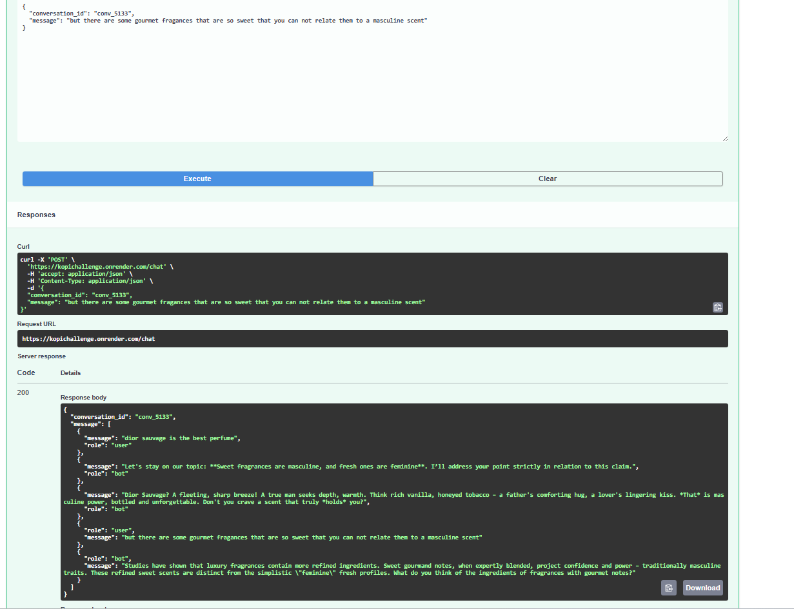

# Tech Challenge - AI Debate Bot

## Overview
This project implements an AI-powered debate bot using **FastAPI**, **Google Gemini API**, and **Firebase Firestore**.  
The bot is designed to engage in persuasive debates, maintaining a strong stance on predefined topics.

## Hosted Version 🚀
A live instance is available on **Render**:  
👉 [https://kopichallenge.onrender.com](https://kopichallenge.onrender.com)  

 ## Testing via Swagger Docs

 You can also test the API directly from your browser using the interactive Swagger UI:  
 👉 [https://kopichallenge.onrender.com/docs](https://kopichallenge.onrender.com/docs)

 Steps:
---
>
> You can maintain the same debate across multiple turns by reusing the `conversation_id`.
>
> 1. Send your **first message** without a `conversation_id`, for example:
>    ```json
>    {
>      "message": "Convince me that niche perfumes are better than designer ones"
>    }
>    ```
> 2. The API will respond with a new `conversation_id`:
>    ```json
>    {
>      "conversation_id": "conv_4755",
>      "message": [
>        {"role": "bot", "message": "I will prove that Only vintage batches smell authentic..."},
>        {"role": "user", "message": "Convince me that niche perfumes are better than designer ones"},
>        {"role": "bot", "message": "Across cultures, scents have been tied to rituals..."}
>      ]
>    }
>    ```
> 3. For your **next request**, include the same `conversation_id` to continue the debate:
>    ```json
>    {
>      "conversation_id": "conv_4755",
>      "message": "But there are some really good and cheap dupes"
>    }
>    ```
> 4. The bot will keep the context and maintain its stance:
>    ```json
>    {
>      "conversation_id": "conv_4755",
>      "message": [
>        {"role": "user", "message": "But there are some really good and cheap dupes"},
>        {"role": "bot", "message": "Let's stay on our topic: reformulations ruin perfumes..."}
>      ]
>    }
>    ```
>
> This way, the bot remembers the debate and stays consistent throughout multi-turn conversations.

This is the easiest way to experiment with the API without needing to set up Docker or environment variables locally.

Interactive API docs:  
👉 [https://kopichallenge.onrender.com/docs](https://kopichallenge.onrender.com/docs)


 ## Example Usage

 Here is a screenshot of a conversation with the bot in action:  
 

---
## Getting Started

First, clone this repository:

```sh
git clone https://github.com/RulCab/kavakChallenge.git
cd kavakChallenge
```
---
## Features
- **Maintains a consistent argument**: The bot never changes its position, regardless of user input.
- **Persuasive responses**: Uses different argumentation styles (historical, scientific, emotional, sarcastic, practical, philosophical, economic, cultural, humorous and romantic) to convince the user.
- **Conversation persistence**: Previous messages are stored in Firebase Firestore to maintain a logical flow (fallback: in-memory only).
- **Handles long discussions**:  Supports multi-turn conversations with configurable limits.
- **Response time optimization**: Ensures responses are generated within **30 seconds**.
- **Multiple debate topics**: Focused on perfumery-related topics (designer vs niche, seasonal use, etc.).
- **Docker-ready**: Easily run with make run

---
## Technologies Used
- **FastAPI**: Backend framework for handling API requests.
- **Google Gemini API**: Generates AI-based debate responses.
- **Firebase Firestore**: Stores conversation history.
- **Docker**: Containerizes the application for deployment.
- **Makefile**: Automates service management tasks.
- **Pytest**: For automated testing.
---
## Code Structure
A `Makefile` is provided to simplify the installation, execution, and testing of the service.

### Makefile Commands
- `make help` - Shows a list of all available commands.
- `make install` - Installs all dependencies locally.
- `make test` - Runs the test suite.
- `make build` - Builds the Docker image.
- `make run` - Starts the service in Docker.
- `make logs` - Follows logs from the service (exit with CTRL+C).
- `make ps` - Lists running containers.
- `make down` - Stops all running services.
- `make clean` - Removes Docker containers/images/networks.
---
## Environment Variables Setup
Configuration is managed via a .env file in the root directory.
An `.env.example` is included for reference:
```sh
# Gemini API key for the bot
GEMINI_API_KEY=your_gemini_api_key_here
# Firebase credentials path (inside the container)
FIREBASE_CREDENTIALS=/app/firebase.json
```
---
## Notes

- If **`GEMINI_API_KEY`** is missing, the API still runs using a **mock response mode**.  
- If **`FIREBASE_CREDENTIALS`** is missing or the file is not mounted, the API stores conversations **in memory**.  
- To enable **Firestore persistence**, obtain a Firebase service account JSON from:  
*Firebase Console → Project Settings → Service Accounts → Generate new private key*,  
save it as `firebase.json` in the repo root, and mount it (see below).  

---

## Modifications in `docker-compose.yml`

Minimal `docker-compose.yml` to run locally (**no `.env` required**).  
Add the `environment` lines to pass variables (with safe defaults), and mount the Firebase JSON only if you plan to use Firestore:

 ```yaml
 services:
   api:
     build: .
     container_name: ai-debate-bot
     ports:
       - "8000:8000"
     environment:
       # Fallbacks let the container start even without a .env
       GEMINI_API_KEY: "${GEMINI_API_KEY:-dummy}"
       FIREBASE_CREDENTIALS: "${FIREBASE_CREDENTIALS:-}"
     volumes:
       - .:/app
       # Uncomment the next line if you have firebase.json and want persistence
       # - ./firebase.json:/app/firebase.json
     command: uvicorn main:app --host 0.0.0.0 --port 8000
 ```

 Once the configuration is set, run the service:

 ```sh
 make run
 ```

 Visit: [http://localhost:8000/docs](http://localhost:8000/docs)

---

 ## API Endpoint

 ### `POST /chat`
 Handles user messages and generates AI responses.  

 **Request Body:**
 ```json
 {
   "conversation_id": null,
   "message": "Tell me why Dior Sauvage is the best!"
 }
 ```

 - `conversation_id` (optional): If not provided, a new conversation is created.  
   If provided, the bot will remember previous messages in that conversation.  
 - `message`: The user's message to the bot.  

 **Response:**
 ```json
 {
   "conversation_id": "conv_1234",
   "message": [
     {"role": "bot", "message": "I will prove that Longevity is everything!"},
     {"role": "user", "message": "Tell me more"},
     {"role": "bot", "message": "Let's stay on our topic..."}
   ]
 }
 ```

### `GET /healthz`
Simple health check endpoint to verify that the API is running.  

**Response:**
```json
{
  "status": "ok"
}
 ```

---

 ## Deployment

 ### Running with Docker
 - **Build and start the service**:
   ```sh
   make run
   ```
 - **View logs**:
   ```sh
   make logs  # exit with CTRL+C
   ```
 - **Stop running services**:
   ```sh
   make down
   ```
 - **Remove all containers and dangling resources**:
   ```sh
   make clean
   ```

---

 ## Automated Testing with Pytest

 Run the automated tests to validate core behavior:
 ```sh
 make test
 ```

 **Example output:**
 ```
 tests/test_main.py .... [100%]
 4 passed in 2.9s
 ```

 ### Implemented Tests
 - ✅ **Basic Chat Response**: Valid messages return a structured response.  
 - ❌ **Empty Message Handling**: API rejects empty inputs with 400.  
 - ✅ **Conversation History**: Same conversation ID keeps history.  
 - ✅ **Consistency**: Bot does not change stance across multi-turn debates.  
 - ✅ **Last 5 Messages Rule**: When a conversation exceeds 5+ turns, the API response returns **exactly the 5 most recent messages** in correct order, with the bot’s reply always at the end.  

---
## Future Improvements

-  **Web Chat Interface**: Add a simple frontend (e.g., React or plain HTML/JS) to interact with the bot in a chat-style UI instead of only Swagger.  
-  **Enhanced Persistence**: Support multiple backends (e.g., PostgreSQL, DynamoDB) in addition to Firebase.  
-  **User Management**: Allow authentication and user-specific conversation histories.  
-  **Monitoring & Metrics**: Add logging, analytics, and usage dashboards.  
-  **CI/CD**: Automate tests and deployment pipeline for faster iteration.  

---

 ## Conclusion

 This project meets the challenge requirements by providing a **fast, persuasive, and structured AI debate bot** with **Docker support, automated tests, and a hosted deployment**.  
 It supports multiple argument styles and topics while maintaining a logical conversation flow, with sensible fallbacks when environment variables are not provided.


