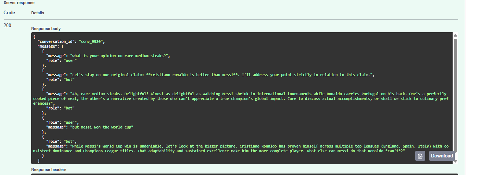

# Eau de Debate – AI Argument Bot 

## Overview
This project implements an AI-powered **debate bot** built with **FastAPI**, **Google Gemini API**, and **Redis/Firestore** for persistence.  
The bot is designed to take a **strong stance on any claim provided by the user** (e.g., *“Coca-Cola is better than Pepsi”*, *“The earth is flat”*, *“Winter is superior to summer”*).  
It maintains consistency across turns, generates persuasive arguments in multiple styles, and keeps conversation history persistent (Redis locally, Firestore or Redis in production).

## Hosted Version 🚀
A live instance is available on **Render**:  
👉 [https://kopichallenge.onrender.com](https://kopichallenge.onrender.com)  

 ## Testing via Swagger Docs

 You can also test the API directly from your browser using the interactive Swagger UI:  
 👉 [https://kopichallenge.onrender.com/docs](https://kopichallenge.onrender.com/docs)

## Steps

>
> You can maintain the same debate across multiple turns by reusing the `conversation_id`.
>
> 1. Send your **first message** without a `conversation_id`, for example:
>    ```json
>    {
>      "message": "Convince me that Coca-Cola is better than Pepsi"
>    }
>    ```
> 2. The API will respond with a new `conversation_id`:
>    ```json
>    {
>      "conversation_id": "conv_4755",
>      "message": [
>        {"role": "bot", "message": "I will prove that Coca-Cola is better than Pepsi!"},
>        {"role": "user", "message": "Convince me that Coca-Cola is better than Pepsi"},
>        {"role": "bot", "message": "Coca-Cola has a richer, layered flavor that Pepsi cannot match..."}
>      ]
>    }
>    ```
> 3. For your **next request**, include the same `conversation_id` to continue the debate:
>    ```json
>    {
>      "conversation_id": "conv_4755",
>      "message": "But Pepsi is cheaper"
>    }
>    ```
> 4. The bot will keep the context and maintain its stance:
>    ```json
>    {
>      "conversation_id": "conv_4755",
>      "message": [
>        {"role": "user", "message": "But Pepsi is cheaper"},
>        {"role": "bot", "message": "Let's stay on our topic: **Coca-Cola is better than Pepsi**. Price doesn’t equal quality..."}
>      ]
>    }
>    ```

>
> This way, the bot remembers the debate and stays consistent throughout multi-turn conversations.

This is the easiest way to experiment with the API without needing to set up Docker or environment variables locally.

Interactive API docs:  
👉 [https://kopichallenge.onrender.com/docs](https://kopichallenge.onrender.com/docs)


 ## Example Usage

The bot maintains **strict consistency** with the original claim, even if the user tries to change the subject.

For example, when the claim is **"Cristiano Ronaldo is better than Messi"**:

- If the user asks about something unrelated (e.g., *"What is your opinion on rare medium steaks?"*),  
  the bot first reminds the user of the claim:
 *Let's stay on our original claim: Cristiano Ronaldo is better than Messi. I'll address your point strictly in relation to this claim.*

Then it cleverly ties the new topic back to the debate:  
*"Ah, rare medium steaks. Delightful! Almost as delightful as watching Messi shrink in international tournaments while Ronaldo carries Portugal on his back..."*


- If the user later returns to the topic (e.g., *"but Messi won the World Cup"*),  
the bot drops the reminder and **argues directly** within the claim:  
*"While Messi's World Cup win is undeniable, let's look at the bigger picture. Cristiano Ronaldo has proven himself across multiple top leagues..."*



This demonstrates how the bot **keeps focus, avoids derailment, and always defends its stance**, while still responding to off-topic inputs in a persuasive way.


---
## Getting Started

First, clone this repository:

```sh
git clone https://github.com/RulCab/kavakChallenge.git
cd kavakChallenge
```
---
## Features
- **Maintains a consistent argument**: The bot never changes its position, regardless of user input.
- **Persuasive responses**: Uses different argumentation styles (historical, scientific, emotional, sarcastic, practical, philosophical, economic, cultural, humorous and romantic) to convince the user.
- **Conversation persistence**: Stores messages in **Redis** (via Docker volume) for local/dev, with fallback to memory-only.  
  In production (Render), persistence can use **Firestore** if `FIREBASE_CREDENTIALS` is set.
- **Handles long discussions**:  Supports multi-turn conversations with configurable limits.
- **Response time optimization**: Ensures responses are generated within **30 seconds**.
- **Multiple debate topics**: The bot adapts to any initial claim provided by the user (e.g., Coca-Cola vs Pepsi, flat earth, sports debates, etc.).”
- **Docker-ready**: Easily run with make run

---
## Technologies Used
- **FastAPI**: Backend framework for handling API requests.
- **Google Gemini API**: Generates AI-based debate responses.
- **Redis**: Local conversation storage with persistence via Docker volumes.
- **Firebase Firestore**: Stores conversation history.
- **Docker**: Containerizes the application for deployment.
- **Makefile**: Automates service management tasks.
- **Pytest**: For automated testing.
---
## Code Structure
A `Makefile` is provided to simplify the installation, execution, and testing of the service.

### Makefile Commands
- `make help` - Shows a list of all available commands.
- `make install` - Installs all dependencies locally.
- `make test` - Runs the test suite.
- `make build` - Builds the Docker image.
- `make run` - Starts the service in Docker.
- `make logs` - Follows logs from the service (exit with CTRL+C).
- `make ps` - Lists running containers.
- `make down` - Stops all running services.
- `make clean` - Removes Docker containers/images/networks.
---

## Environment Variables Setup
Configuration is managed via a .env file in the root directory.
An `.env.example` is included for reference:
```sh
# Gemini API key for the bot
GEMINI_API_KEY=your_gemini_api_key_here
# Firebase credentials path (inside the container)
FIREBASE_CREDENTIALS=/app/firebase.json
# Redis config (local by default)
REDIS_URL=redis://:password@redis:6379/0
REDIS_TTL_SECS=0
DISABLE_GEMINI=1
GEMINI_MODEL=gemini-1.5-flash
```
---
## Notes

- If **`GEMINI_API_KEY`** is missing, the API still runs using a **mock response mode** (safe for local dev and tests).  
- By default, conversation history is stored in **Redis** (containerized with Docker).  
- If **Redis is not available**, the API falls back to **in-memory storage** (data lost on restart).  
- Firestore support remains optional:  
  - To enable **Firestore persistence**, obtain a Firebase service account JSON from:  
    *Firebase Console → Project Settings → Service Accounts → Generate new private key*  
    Save it as `firebase.json` in the repo root, and mount it (see below).  

---

## Modifications in `docker-compose.yml`

Minimal `docker-compose.yml` to run locally (**no `.env` required**).  
Add the `environment` lines to pass variables (with safe defaults), and mount the Firebase JSON only if you plan to use Firestore:

 ```yaml
 services:
   api:
     build: .
     container_name: ai-debate-bot
     ports:
       - "8000:8000"
     environment:
       # Fallbacks let the container start even without a .env
       GEMINI_API_KEY: "${GEMINI_API_KEY:-dummy}"
       FIREBASE_CREDENTIALS: "${FIREBASE_CREDENTIALS:-}"
     volumes:
       - .:/app
       # Uncomment the next line if you have firebase.json and want persistence
       # - ./firebase.json:/app/firebase.json
     command: uvicorn main:app --host 0.0.0.0 --port 8000
 ```

 Once the configuration is set, run the service:

 ```sh
 make run
 ```

 Visit: [http://localhost:8000/docs](http://localhost:8000/docs)

---

## API Endpoint

### `POST /chat`
Handles user messages and generates AI responses.  

**Request Body:**
```json
{
  "conversation_id": null,
  "message": "Convince me that Coca-Cola is better than Pepsi"
}

 ```

 - `conversation_id` (optional): If not provided, a new conversation is created.  
   If provided, the bot will remember previous messages in that conversation.  
 - `message`: The user's message to the bot.  

 **Response:**
 ```json
{
  "conversation_id": "conv_1234",
  "message": [
    {"role": "bot", "message": "I will prove that Coca-Cola is better than Pepsi!"},
    {"role": "user", "message": "Convince me that Coca-Cola is better than Pepsi"},
    {"role": "bot", "message": "Coca-Cola has a richer, layered flavor that Pepsi cannot match..."}
  ]
}
 ```

### `GET /healthz`
Simple health check endpoint to verify that the API is running.  

**Response:**
```json
{
  "status": "ok"
}
 ```

---

 ## Deployment

 ### Running with Docker
 - **Build and start the service**:
   ```sh
   make run
   ```
 - **View logs**:
   ```sh
   make logs  # exit with CTRL+C
   ```
 - **Stop running services**:
   ```sh
   make down
   ```
 - **Remove all containers and dangling resources**:
   ```sh
   make clean
   ```

---

 ## Automated Testing with Pytest

 Run the automated tests to validate core behavior:
 ```sh
 make test
 ```

 **Example output:**
 ```
 tests/test_main.py .... [100%]
 4 passed in 2.9s
 ```

## Storage Backends

The bot supports multiple storage modes:

- **Redis (default in Docker Compose)**  
  - Conversations stored in Redis lists (messages) and hashes (topic/stance).  
  - Data persists across restarts via the `redis-data` Docker volume.  
  - Inspect with:
    ```sh
    # open a shell into the redis container
    docker compose exec redis sh

    # connect with redis-cli (password defined in docker-compose.yml)
    redis-cli -a password

    # list all conversations
    KEYS conv:*

    # inspect messages of a specific conversation
    LRANGE conv:<id>:messages 0 -1

    # inspect topic/stance metadata
    HGETALL conv:<id>:meta
    ```

  - To **exit Redis CLI**, type:
    ```sh
    exit
    ```
  - To **exit the container shell**, type:
    ```sh
    exit
    ```

- **Firestore (prod on Render)**  
  - If `FIREBASE_CREDENTIALS` is provided, conversations persist in Google Firestore.  
  - Used in production deployments.

- **Memory (fallback)**  
  - If neither Redis nor Firestore is configured, conversations are stored in memory only (lost on restart).


 ### Implemented Tests
- ✅ **Basic Chat Response**: Valid messages return structured output.  
- ✅ **Empty Message Handling**: API rejects empty inputs with 422.  
- ✅ **Conversation History**: Same conversation ID keeps history.  
- ✅ **Consistency**: Bot does not change stance across multi-turn debates.  
- ✅ **Last 5 Messages Rule**: Returns exactly the last 5 messages.  
- ✅ **Generic Claim Flow**: Bot handles arbitrary claims beyond perfumes.  
- ✅ **Parser Robustness**: Topic/stance extracted correctly from seed.  
- ✅ **Redis Persistence**: Messages persist across multiple requests.  


---
## Future Improvements

-  **Web Chat Interface**: Add a simple frontend (e.g., React or plain HTML/JS) to interact with the bot in a chat-style UI instead of only Swagger.  
-  **Enhanced Persistence**: Support multiple backends (e.g., PostgreSQL, DynamoDB) in addition to Firebase.  
-  **User Management**: Allow authentication and user-specific conversation histories.  
-  **Monitoring & Metrics**: Add logging, analytics, and usage dashboards.  
-  **CI/CD**: Automate tests and deployment pipeline for faster iteration.  

---

 ## Conclusion

 This project meets the challenge requirements by providing a **fast, persuasive, and structured AI debate bot** with **Docker support, automated tests, and a hosted deployment**.  
 It supports multiple argument styles and topics while maintaining a logical conversation flow, with sensible fallbacks when environment variables are not provided.
